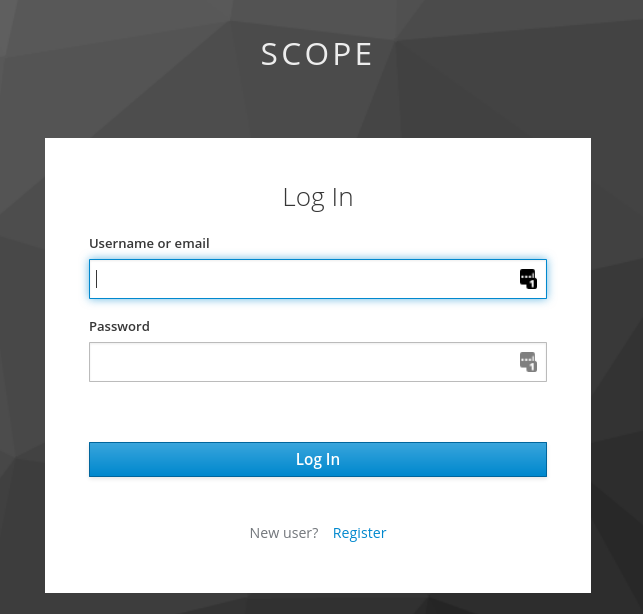

[](https://www.codefactor.io/repository/github/aertslab/scope)

# SCope: Visualization of large-scale and high dimensional single cell data


SCope is a fast visualization tool for large-scale and high dimensional scRNA-seq datasets.
Currently the data format supported by SCope is `.loom`. This file format for very large omics datasets is maintained by the Linnarsson Lab through the `loompy` Python package (https://github.com/linnarsson-lab/loompy).

View the [change log here](CHANGELOG.md).

## Demo

Visit [https://scope.aertslab.org](https://scope.aertslab.org) to test out SCope on several published datasets! Personal loom file files can be uploaded but will only be kept for 5 days.

## Loom File Generation

Currently there are two packages to generate extended loom files compatible with SCope.

-   R: [SCopeLoomR](https://github.com/aertslab/SCopeLoomR) - Dedicated R package
-   Python: [pySCENIC](https://github.com/aertslab/pySCENIC) - Single function for generation from SCENIC results

Eventually the functionality from pySCENIC will be expanded and put in its own python package.

## HTTP API Documentation

You can find auto-generated at `/api/v1/docs`.

## Run SCope

You will need access to at least Python 3.8 do run this.

1. Clone the GitHub repository and install,

```bash
# Define where you want to clone the SCope repository.
LOCAL_SCOPE_REPO="${HOME}/repos/SCope"
# Clone SCope git repository.
git clone https://github.com/aertslab/SCope "${LOCAL_SCOPE_REPO}"
# Go to your local cloned SCope repository.
cd "${LOCAL_SCOPE_REPO}"
# Install server dependencies
cd server/
poetry install
```

2. Configure an identity provider

Users are authenticated using OpenID Connect. Ensure you have the client identifer and secret provided
to you by the provider you will use:

```bash
poetry run scope-console add-identity-provider --issuer ${PROVIDER_URL} --clientid ${CLIENT_ID} --secret ${SECRET} --name ${PROVIDER_NAME}
```

3. Add the first server administrator

You will need to know the subject identifier of the user you wish to make an admin as provided by your chosen OpenID Connect provider.

```bash
poetry run scope-console create-admin --iss ${PROVIDER_URL} --sub ${SUBJECT_ID} NAME
```

4. Allow uploading LOOM files:

You will need to consider the maximum file size you will allow (this can be changed later)

```bash
# Allow uploading LOOM files up to 1 GiB
poetry run scope-console add-upload-limit --mime="application/vnd.loom" --size=1073741824
```

5. Finally, run the server

```bash
# TBD
```

## Development

SCope consists of 3 major modules:
- Client (displays the interface in the web-browser)
- Server (provides all services to the client)
- GRPC-Proxy (Proxies GRPC requests between the Server the the Client)

HTTP API documentation can be found by running the server and navigating to `http://localhost:8000/docs`. Or by using
[Postman](https://www.postman.com) to view the SCope collection found in `SCope.postman_collection.json` file.

1. Clone the Repo

```bash
# Define where you want to clone the SCope repository.
LOCAL_SCOPE_REPO="${HOME}/repos/SCope"
# Clone SCope git repository.
git clone https://github.com/aertslab/SCope "${LOCAL_SCOPE_REPO}"
# Go to your local cloned SCope repository.
cd "${LOCAL_SCOPE_REPO}/"
```
2. Run the GRPC-Proxy

```bash
# Go to the GRPC-Proxy directory
cd "${LOCAL_SCOPE_REPO}/grpc-proxy-server/"
# Install dependencies
npm install
# Start the proxy server
node server.js
```
3. Run the local OpenID Connect provider

```bash
docker-compose up
```

4. Run the Server in development mode

```bash
# Go to the GRPC-Proxy directory
cd "${LOCAL_SCOPE_REPO}/server/"
# Install dependencies
poetry install
# Start the Server
./run-dev-env.sh
```

5. Run the client in development mode

```bash
# Go to the Client directory
cd "${LOCAL_SCOPE_REPO}/client/"
# Install dependencies
npm install
# Start SCope Client
npm start
```

You can now open a web-broswer and point it to the URL logged by the client development server. This is generally
[http://localhost:55853](http://localhost:55853).

The `./run-dev-env.sh` script runs all migrations not applied to the database before starting
the server. To create a new migration you should update `scopeserver/models.py` then run alembic like:
```bash
poetry run dotenv run alembic revision --autogenerate -m "Short summary of changes"
```
This will generate a migration script that you can then manually edit if necessary. See the
[Alembic tutorial](https://alembic.sqlalchemy.org/en/latest/tutorial.html) for more information.


### Authentication

[OpenID Connect](https://openid.net/connect/), an identity layer on top of [OAuth2](https://oauth.net/2/),
is used for SCope user authentication.

#### Definitions

Identity provider
: a third-party service providing an OpenID Connect API. Also known as an "authorization server", "Issuer", or "OpenID Provider".

#### Context
The OpenID Connect
[Authentication Code flow](https://openid.net/specs/openid-connect-core-1_0.html#CodeFlowAuth) is used to obtain
a token to access user info from the identity provider. However this is necesary in the context of a SCope client
requesting a token to access the SCope API. See the SCope API token request flow below:


An identity provider can uniquely identify a user with a _subject identifier_. Therefore, a user is globally uniquely
identified by a combination of Issuer and Subject. This is reflected in the database schema.

#### New user access to SCope API

1. User navigates to the SCope client web app
1. SCope client makes a request to `/api/v1/auth/loginurl` which returns a list of accepted OpenID Connect
   identity providers and associated login URLs. These URLs are displayed in the client as login buttons.
1. The user click on a login button and is redirected to the third-party login and consent form.
1. The third-party identity provider authenticates the user and redirects the browser back to the
   SCope client with an authorization `code` and the client state.
1. The SCope client sends a SCope API access token request to `/api/v1/auth/authorize` along with the
   authorization code and client state.
1. The SCope API server verifies the identity of the user by requesting a token from the identity
   provider using the authorization code. Once the token is obtained, `userinfo` is also requested
   from the identity provider and a the user data is entered into the database.
1. A SCope API access token is minted and returned to the SCope client along with basic user info.

#### Client authentication and authorization for API access

1. SCope client makes a request on an authenticated API
1. SCope API server decodes the bearer token and checks the signature and expiry date
1. If the bearer token is valid, has not expired, and the user has permission to access the API
   then the request is successful.

If the request is not successful the SCope client may transition to a "logged out" state and
give the user the opportunity to log in again.

#### Local development

Use the `scope-console` server administration interface to control recognised identity providers. Necessary
information to add an identity provider are:
- Identity provider URL
- Client ID issued by the identity provider
- Client secret issued by the identity provider

For development purposes, you can use a local [KeyCloak](https://www.keycloak.org/) instance as an
identity provider. This is started with a `docker-compose up -d` (make sure you wait until it is
fully operational, about 20 seconds, before starting the SCope API server).

The `run-dev-env.sh` script automatically adds the local keycloak instance as an identity provider.
After you run the `run-dev-env.sh` script, you can request a token. I will describe the process of
using the API with [Postman](https://www.postman.com/) here, other systems and services will work as well.

1. Start Postman and import `server/SCope.postman_collection.json`.
1. Open the "Authorization" collection and double-click on the "Get login urls" request. Send this request.
1. Copy the entire response URL into a web browser. You will be presented with the KeyCloak login
   screen. The username is "scope" and the password is "scope":
   
1. If login is successful, KeyCloak will redirect your browser. You must copy the `code` field.
   
1. Back to Postman, open the "Authorization" collection and double-click on the "Get API token"
   request. In the body tab, paste the `code` and send the request.
1. If all goes well, Postman will save the token response and you can now make authenticated API
   requests.

### Static Analysis with SonarQube

[LogRocket](https://blog.logrocket.com/how-to-use-static-code-analysis-to-write-quality-javascript-typescript/) have a blog
post describing how to set up and use SonarQube for whole system static analysis (amongst other tools).

Essentially, download `sonar-scanner` from [here](https://docs.sonarqube.org/latest/analysis/scan/sonarscanner/). Then
run the SonarQube server in docker:

```bash
docker run -it --rm --name sonarqube -p 9000:9000 sonarqube:8.3-community
```

Login with `admin`/`admin` at `localhost:9000`, Create a new project and get the token. Then run

```bash
sonar-scanner -Dsonar.projectKey=scope -Dsonar.sources=. -Dsonar.host.url=http://localhost:9000 -Dsonar.login=${TOKEN}
```

This should take about 30 seconds. Then you can find the results at `localhost:9000`.
